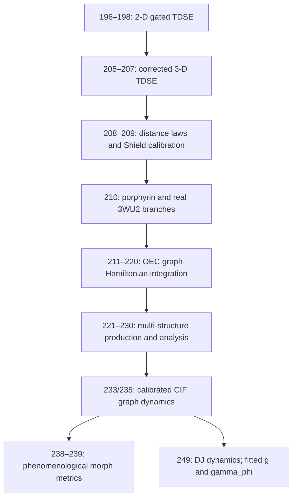

# QGE / AOI Programme — Annotated Notebook Pipeline Index

**Consolidated audit edition: 2 September 2026**  
**Scope of this revision:** lossless reconciliation of the latest notebook audit with the two preceding index layers, with a substantially rebuilt 196–249 interval.

## How to read this index

Notebook numbers are archival labels, not a guarantee of a single linear chronology. Copies, recovered files, clean reruns, resumed jobs, reconstructions and alternate branches may preserve scientifically useful differences. They must not be discarded as duplicates until their code, parameters, inputs and outputs have been compared.

Evidence labels used below:

- **Real structural input** — reads crystallographic or otherwise external physical structure data.
- **Explicit TDSE** — numerically propagates a wavefunction under an explicit Hamiltonian or split-operator scheme.
- **Phenomenological Hamiltonian** — propagates a state, but the Hamiltonian/couplings are constructed model assumptions rather than an ab-initio electronic Hamiltonian.
- **Phenomenological metric** — evaluates a prescribed response or score without solving a Schrödinger equation.
- **Empirical calibration** — fits or compares external measurements or literature laws.
- **Imposed scaling** — isotope, coupling, mass, breathing or gating dependence is inserted by modelling choice.
- **Mock geometry / placeholder / presentation** — illustrative content, not physical validation.
- **Post-processing** — analyses saved outputs rather than generating primary dynamics.
- **Corrected rerun** — repairs an earlier implementation or incomplete output format.
- **Provisional** — inherited from an older index and not yet verified against authoritative source code.

## Shield-law provenance and present audit conclusion

The Shield law was **first in print in GQR4**, earlier than the notebook-208/212 material. Accordingly, notebooks 208 and 212 are not the origin of the printed law; they are later calibration, representation and application stages.

The historical criterion is

\[
S=\frac{g^2}{\kappa\gamma_\phi}, \qquad S=1.
\]

The audit must distinguish three separate questions:

1. Where was the expression first printed? **GQR4.**
2. Where was it later imposed, plotted or used as a reference line? **At least notebooks 208 and 212.**
3. Did any historical dynamics independently select a crossover at \(S=1\), \(S=1/4\), or elsewhere? **Not established by the material audited through notebook 249.**

A bright-state/Purcell-like rate \(\Gamma_{\rm bright}=4g^2/\kappa\) would yield \(g^2/(\kappa\gamma_\phi)=1/4\) if the crossover is defined by \(\Gamma_{\rm bright}=\gamma_\phi\). That is a legitimate competing normalization argument, not by itself proof that the historical simulations selected one quarter. Conversely, the earlier printed use of \(S=1\) establishes provenance, not a dynamical derivation.

Notebook 249 is relevant because it extracts \(g\) and \(\gamma_\phi\) from simulated dynamics. It still does not visibly test the full three-rate Shield ratio or locate a threshold. Its variable named `kappa_grid` is \(g^2/\gamma_\phi\), not necessarily the loss rate \(\kappa\) in the Shield law.

## Reconstructed notebook chronology: 196–249

### 196–198 — 2-D GQR / TDSE gate development

**Purpose:** Early split-operator TDSE implementation and development of the H/C/I/B/E gate framework.

| Notebook | Main content | Evidence / status | Lineage |
|---|---|---|---|
| 196 | 2-D split-operator TDSE movie engine; H funnel, C field, B tilt and I/PCET-proxy potentials; B sweeps and controls. | **Explicit TDSE; core precursor.** | Feeds 197–198 and later 3-D gate dynamics. |
| 197 | GPU/CPU HCIBE implementation with dephasing, systematic condition sweeps and aperture/flux metrics. | **Explicit TDSE; quantitative sweep.** | Extends 196; feeds 198. |
| 198 | Cleaned publication/movie implementation with synchronized nine-condition HCIBE comparison and composite figures. | **Explicit TDSE; production/visualisation.** | Consolidates 196–197. |

### 199–204 — unresolved archive interval

No direct source-level annotations were recovered in the three merged lists. Preserve any surviving variants for future audit. Do not infer their contents solely from the surrounding sequence.

### 205–207 — 3-D TDSE and directional gate dynamics

| Notebook | Main content | Evidence / status | Lineage |
|---|---|---|---|
| 205 | 3-D split-operator HC/HCB simulations with XY/XZ/YZ slices, maximum-intensity projections, movies and snapshots. | **Explicit TDSE; 3-D precursor.** | Extends 196–198. |
| 206 | Refined 3-D scheme with the correct potential half steps, including \(dt/(2\hbar)\), and a time-dependent C-field lens. | **Explicit TDSE; corrected rerun.** | Substantive Strang-propagator correction to 205. |
| 207 | Cleaner HC-versus-HCB production run and 4×3 comparative movie/figure assembly. | **Explicit TDSE; production.** | Consolidates corrected 3-D branch. |

### 208–210 — Shield calibration and transition to real systems

| Notebook | Main content | Evidence / status | Lineage and cautions |
|---|---|---|---|
| 208 | Electron/H/D/T distance-rate curves, uncertainty envelopes, Gray–Winkler and MADH/Masgrau comparisons; explicit Shield-guideline work. | **Empirical calibration; imposed/reference criterion.** | Develops and calibrates a law already printed in GQR4; does not yet demonstrate a dynamically selected threshold. |
| 209 | Expanded electron and nuclear tunnelling comparisons, literature datasets and alternate Shield representations. | **Empirical calibration.** | Refinement of 208. |
| 210 PorphREE | Generic gated 3-D TDSE applied to porphyrin-SAM/REE, graphene control and Fe²⁺/Fe³⁺ porphyrin systems. | **Explicit model TDSE; real-system concept application.** | Separate surviving notebook-210 branch. |
| 210 PSII | Reads real 3WU2 CIF data; selects the CaMn₄ cluster, μ-oxo candidates and nearby waters. | **Real structural input; preprocessing.** | Important shift from schematic to crystallographic OEC geometry. |

### 211–220 — transport laws, OEC models and graph dynamics

These notebooks overlap heavily and contain successive revisions within single files. The direct-source audit below supersedes the earlier high-level descriptions where they conflict, while retaining their useful lineage claims.

| Notebook | Main content | Evidence / status | Lineage and cautions |
|---|---|---|---|
| 211 | Large bridge from Gray–Winkler/Masgrau-style rate–distance fitting to GQR feedback/deformation and effective-velocity comparisons. | **Empirical calibration + phenomenological extension.** | Foundation for later hydration/transport plots; assumed GQR deviation is not validation. |
| 212 | First OEC hydration/Shield presentation: TyrZ sweeps, dry-versus-hydrated OEC and static/animated plots. | **Phenomenological model; Shield criterion imposed.** | A later application of the law first printed in GQR4, not its origin or dynamical derivation. |
| 213 | Genuine 1-D split-operator barrier-transmission TDSE; exploratory Biological Amplituhedron material; mock OEC coordinates followed later by actual 3WU2-derived geometry. | **Explicit TDSE + mixed mock/real geometry.** | Records the important sequence generic TDSE → mock OEC → real CIF-derived OEC. |
| 214 | Hashing/provenance and NPZ checkpoints; coloured \(k(d)\) plots; phenomenological GQR rate models; numerical TDSE visualisation. | **Validation infrastructure + mixed phenomenological/TDSE content.** | Improves reproducibility, but is not first-principles OEC physics. |
| 215 | Extracts 3WU2 geometry, assigns waters, constructs a GQR-modified graph/tight-binding Hamiltonian and propagates \(\psi(t+\Delta t)=Ve^{-iE\Delta t}V^\dagger\psi(t)\). | **Real structural input + explicit state propagation + phenomenological Hamiltonian.** | Major integration point. Later placeholder/visual cells remain non-evidence. |
| 216 | GPU/CuPy and checkpoint/resume development; OEC propagation material; explicitly mock Kok-state geometries in parts. | **Explicit TDSE/model propagation + mock geometry + production infrastructure.** | Consolidation, not uniformly real-structure evidence. |
| 217 | Cleaner fixed-geometry production descendant: cached real CIF OEC graph, GQR pair couplings, propagation, population observables and saved states. | **Real structural input + explicit propagation + phenomenological Hamiltonian.** | Stronger production implementation than surrounding presentation notebooks. |
| 218 | Simplified graph/network and presentation layer, including hypothetical resonance-flow paths and a GPU propagation skeleton. | **Schematic / presentation / partial implementation.** | Useful diagramming support; not primary dynamical evidence. |
| 219 | Figure regeneration, static hydration/Shield graphics and other presentation material while continuing OEC development. | **Mostly presentation / post-processing.** | Preserve variants; claims depend on upstream model outputs. |
| 220 | Consolidated 7-, 12- and 16-site OEC graph Hamiltonians with μ-oxo/water-network structure and explicit propagator/population histories. | **Explicit state propagation + phenomenological Hamiltonian.** | Proof-of-principle model engine, not an ab-initio OEC Hamiltonian. |

### 221–230 — real-structure OEC production and downstream analysis

The older index assigned very specific jobs to each number. Direct inspection supports the overall branch but not every old one-line mapping. The entries below preserve the older hypotheses while grading certainty.

| Notebook | Consolidated role | Evidence / status |
|---|---|---|
| 221 | Real PSII/OEC geometry extraction across structures such as 4RTI, 5XNL, 5XNM and 4IXQ; μ-oxo and W1–W4 handling. | **Real structural input; core geometry.** |
| 222 | 16-site GPU model engine with checkpointing, resonance combs and Shield-related parameters. | **Explicit propagation + phenomenological Hamiltonian; production precursor.** |
| 223 | Geometry-to-model-dynamics bridge with H₂O/D₂O/T₂O and H₂S variants. | **Real structural input + imposed isotope scaling.** Isotope response is model sensitivity, not ab-initio isotope prediction. |
| 224 | OEC structural refinement and coordinate validation. | **Provisional:** inherited role; direct source confirmation still required. |
| 225 | KIE fitting, \(\tau\) extraction, Arrhenius-style and isotope-comparison metrics. | **Post-processing / model analysis.** Interpretation inherits imposed isotope assumptions upstream. |
| 226 | Missing or superseded intermediate OEC notebook. | **Unresolved / provisional.** Preserve any recovered variant. |
| 227 | Automated multi-structure OEC batch runner with repeated propagation and CSV output. | **Production model dynamics.** |
| 228 | Aggregation, population comparisons and statistical summaries across structures/conditions. | **Post-processing.** |
| 229 | FFT/dominant-frequency extraction and spectral summaries from trajectories. | **Post-processing / frequency analysis.** |
| 230 | Downstream multi-geometry analysis: FFTs, summary statistics, isotope/solvent series, O–O trajectories and publication exports. | **Post-processing / publication pipeline.** |

### 231–240 — side branch, calibration, and a later phenomenological turn

| Notebook | Consolidated role | Evidence / status |
|---|---|---|
| 231 | ERA5/hurricane curvature-information, MSE-flux and PV-gradient work. | **Independent environmental side branch.** Earlier descriptions as merely “Storm/GQR” were directionally right but underspecified. |
| 232 | Shield-index robust statistics, including mean±SD versus median±MAD comparisons. | **Provisional validation/post-processing role.** |
| 233 | OEC structural calibration feeding a CIF-derived Mn₄Ca/O/water graph Hamiltonian. | **Real structural input + calibration.** |
| 234 | Intermediate utility or plotting notebook. | **Unresolved / provisional.** |
| 235 | CIF-derived Mn₄Ca/O/water Hamiltonian and genuine state propagation; participation-ratio/current-proxy analyses may also appear in this development branch. | **Real structural input + explicit propagation + phenomenological Hamiltonian; advanced observables.** Isotope response remains deliberately modelled. |
| 236 | Veracity/validation and extended isotope comparison. | **Provisional; likely mixed validation and imposed isotope scaling.** |
| 237 | GPU optimisation / larger production runs. | **Provisional performance role.** |
| 238 | “TDSE veracity” naming notwithstanding, morphs H→I→J geometries and computes a prescribed \(J\)-metric from a Gaussian resonance term, O–O-distance penalty and temperature noise; includes `run_tdse_like`. | **Phenomenological morph-and-metric simulation; not TDSE evidence.** |
| 239 | Same later GQR-XIV phenomenological branch; trajectory/figure generation and resonance ablation based on the prescribed metric. | **Phenomenological metric + presentation.** Removing an imposed resonance term is an ablation of the assumption, not independent proof of resonance or Schrödinger dynamics. |
| 240 | Final consolidation before later QGE development. | **Unresolved / provisional; direct inspection needed.** |

### 241–248 — unresolved archive interval

The merged lists contain no reliable source-level annotations for these numbers. Preserve all extant files and variants. Their chronological position must not be used to infer method or evidential strength.

### 249 — DJ coherence maps and Shield-adjacent dynamical extraction

**Authoritative source:** `untitled249.py` only. Any older `249.ipynb` context is excluded from this entry.

**Purpose:** Build 16-site PSII/OEC core models from real CIF structures (3WU2, 6W1U, 7RF1 and 8F4C–8F4K), explore duty/water-\(\beta\) grids, propagate states and extract coherence-map observables.

**Inputs:** CIF-derived selections of four Mn atoms, Ca, five μ-oxo sites and waters; distance-dependent couplings; resonance comb, duty factor and water-\(\beta\) model parameters.

**Primary computation:** A phenomenological distance-dependent Hamiltonian is propagated with

\[
U=\exp(-iH\Delta t/\hbar).
\]

The notebook tracks Ca and Mn₃ populations, extracts an oscillation frequency from the FFT of \(P_{\rm Ca}-P_{\rm Mn}\), defines \(g=\hbar\Omega\), and estimates \(\gamma_\phi\) by fitting an exponential envelope to a Hilbert-transform amplitude.

**Outputs:** Per-structure DJ grids/NPZ files containing `g_grid`, `gamma_grid`, `Q_grid`, `kappa_grid`, `duties` and `betas`; coherence-map figures and population/frequency diagnostics.

**Evidence grade:** **Real structural input + explicit state propagation + phenomenological Hamiltonian + fitted dynamical observables + corrected rerun.** It is more relevant to Shield provenance than notebooks that merely set \(g\) and \(\gamma_\phi\), but it is still not an ab-initio electronic calculation.

**Development/repair sequence:** The first generation of `DJ_{struct}_wow.npz` saves only `g_grid`, `duties` and `betas`, while later cells attempt to load `gamma_grid`, `Q_grid` and `kappa_grid`. Later cells regenerate the files with all four derived grids. Treat the file as a development/repair history, not a single immutable run.

**Notation hazard:**

\[
Q=\frac{g}{\gamma_\phi}, \qquad \texttt{kappa\_grid}=\frac{g^2}{\gamma_\phi}.
\]

Here `kappa_grid` is a derived quantity with energy/rate-like dimensions. It must not silently be identified with the independent loss rate \(\kappa\) in \(S=g^2/(\kappa\gamma_\phi)\).

**Threshold conclusion:** The visible code does not establish a crossover at \(S=1\) or \(S=1/4\). It extracts \(g\) and \(\gamma_\phi\) from its own model dynamics but does not independently scan or infer the full Shield threshold.

## Consolidated developmental map through 249

The key methodological lesson is that **chronological lateness does not imply stronger evidence**. An earlier explicit Hamiltonian or split-operator calculation can be a stronger dynamical implementation than a later notebook whose title says “TDSE” but whose code evaluates a prescribed metric.

## Programme-level entries retained from the preceding indexes

These entries sit outside the newly reconstructed interval and are retained without pretending that they have all received the same source-level audit.

| Notebook/family | Consolidated role | Status / lineage |
|---|---|---|
| 178 | TPU agent-based RNA/protoribosome evolution with damage, repair, survival and checkpointing. | Exploratory selection/admissibility analogue. |
| 252 | First real Fe–S geometry-to-SCF/curvature pipeline, notably 6LK1 using PySCF and gemmi. | Core Fe–S foundation; feeds 253–260, 273, 332. Multiple copies must be preserved. |
| 253–260 | Fe–S cluster extraction, comparative curvature, histogram/comb development and refinement. | Transitional-to-core corridor; 259–260 emphasize comparative refinement/validation. |
| 273 / 273A | Controlled Fe–S distortions, SCF density, GPU Laplacian/HOMO outputs; Δteeth measurement blocks. | Core perturbation and observable layer; preserve `Copy_of_Untitled273` and `...273shearer` variants. |
| 274 | CIF-informed OEC/PSII-like Hamiltonian propagation, coupling/decoherence and comparator grids. | Core Schrödinger-side model-dynamics layer; feeds batch runners. |
| Paper 4 Gauge Atlas | Kraus/Choi/channel ordering, diamond-distance and admissibility atlas work. | Advanced operational/channel core; Heisenberg-facing bridge. Preserve Clean/Fresh/Copy variants. |
| Floquet/AOI paper recreation | Toy AOI ladder, missing-rung counts, defect laws, hysteresis and figure recreation. | Paper-core theory-to-figure pipeline. |
| 307 | Early AFC/ladder-state recurrence and admissibility precursor later linked to GQR47. | Historically important; manuscript articulation post-dates notebook. |
| 308 | Gauge/geometric analysis precursor. | Feeds 309; details remain to be rechecked. |
| 309 | Gauge Atlas / fracture / operational accessibility across symmetric and asymmetric channels. | Core/transitional AOI geometry notebook; feeds GQR49 and Gauge Atlas. |
| 310 | Governance-controller Monte Carlo using geometry, coherence and admissibility constraints. | Core experimental governance/AFC optimisation branch. |
| 311 | Fusion tile topology, thermal transport and stress proxies. | Engineering application; feeds GQR49 fusion work. |
| 315 | Hyperbolic hBN/correlated-material spectroscopy or related hBN geometry/transport exploration. | **Conflicting inherited descriptions; unresolved pending direct inspection.** Preserve both hypotheses. |
| 318 | Germinal-centre balloon/foam mechanics with clonal evolution and lineage selection. | Core biological-systems notebook. |
| 321 | Affine Bloch admissibility, cone margins and Schrödinger–Heisenberg fracture correspondences. | Exploratory-core; feeds 322. Copy variant present. |
| 322 | Reduced noncommuting divisibility-fracture model; gap field, boundary curves, bands and ridge/ladder structure. | Clean core-theory entry point. |
| 323–324 | Inherited descriptions conflict between honeycomb AOI transport/dense ladder sweeps and a HEX-plasma branch. | **Branch/number collision requiring filename-level audit.** Preserve both rather than overwrite either. |
| 327 | Exact fusion seam/tiling geometry comparisons. | Core geometry method; feeds 329. |
| 328 | Phase-sheet/ridge analysis or smooth-dictionary conceptual compression. | **Variant or number collision; unresolved.** |
| 329 | Reproducible fusion workflow and paper/report exports. | Production continuation of 327. |
| 331 | Fe–S Δteeth staircases, jump detection, shuffle/null tests and harmonics; also panel aggregation functions. | Important analysis/figure pipeline, not merely a generic panel builder. Feeds 332 and SM2 lineage. |
| 332 | Full DFT/curvature-to-ladder pipeline; also associated with CIF/OEC structural import in an older list. | Major real-system milestone; inspect variants before resolving apparent collision. |
| 333 | Fe–S ladder/trap topology, signed masks and connected-component observables. | Major chemistry-to-topology upgrade; CAT1 lineage. |
| 334 | Fe–S Laplacian/curvature probability and occupancy fields. | More physically grounded than the older “AOI supersolid toy” label; preserve possibility of variants. |
| 337 | Spectral AOI, missing rungs and twisted-ladder topology. | Major spectral-topology branch; feeds RH/admissibility work. |
| 338 | Defect residual versus \(\lambda_*\), criticality and optimization maps. | Mathematical optimisation branch. |
| 339 | AOI chirality, signed-curl/magnetisation, vortex regimes, D/L masks and selection ridges. | Major conceptual family feeding GQR73; multiple evolved/text-export forms. |
| 345 | AFC recurrence/channel mismatch and diamond-norm bridge. | Strong operational-information bridge toward GQR72. |
| 347 | Flow-ladder eigenvectors and spectral admissibility. | Spectral-flow notebook family. |
| 348 | Fuzz-filter/Stokes-flow bounds and coarse-grained admissibility. | Continuum-flow branch. |
| 351 | Unified master-equation / Rosetta-style synthesis figures. | Major programme synthesis notebook. |
| 352–353 | CMS collider suppression, parton and multiplicity analyses. | Core GQR60–63 collider branch. |
| 354–355 | NASA electrostatic thrust / Maxwell-stress closure, asymmetry and AOI-lag tests. | EM closure-analysis branch. |
| 356 | AFC6 recurrence-selection and admissibility persistence. | Mature AFC continuation; feeds GQR72. |
| 362 | Toy RH ladder and spectral admissibility transitions. | Historical precursor to GQR71 RH work. |

### Other named production families retained

- **OEC batch runner:** multi-CIF production runs, per-run CSVs, master CSV and water-population tracking; depends on 274.
- **H₂O/phase-trend enrichment:** enriches the OEC master table with phase/time and S-state-aligned summaries; analysis rather than primary simulation.
- **GQR49 geometry/fracture family:** threshold-locked, pitch-sweep, rotation-control, ROI-mask, damage-motif and full self-contained variants. This family is substantially broader than a single notebook entry.
- **AFC/governance/ladder bridge family:** `afc_sh_ladder_bridge_notebook`, AFC/QGE skeleton, AFC6 and clean regime workbooks.
- **GC governance-control family:** master, sweep-clean and clone-label variants for admissibility, persistence and trajectory governance.
- **Floquet/reconstruction/Gauge Atlas family:** paper recreation plus Clean/Fresh/Copy Gauge Atlas variants.
- **CAT reconstruction/figure workflows:** CAT1 Fe₂ article-figure rebuild and ladder SI figure packet.

## Variant-preservation policy

The archive contains files labelled recovered, resumed, reconstructed, clean, hardened, fresh, skeleton, working, recreated, clone-label, “copy of” and untitled. Such labels often encode parameter recovery, partial reruns, alternative hypotheses, figure-regeneration paths or emergency snapshots. Therefore:

1. Preserve every variant until hashes and code/parameter/output diffs have been recorded.
2. Assign one authoritative source only when the audit establishes it explicitly (as for notebook 249).
3. Record correction sequences rather than silently replacing the earlier state.
4. Separate **what the code computes** from **what notebook markdown or filenames claim**.
5. Mark imposed, derived, numerically observed, heuristic, mock and merely plotted quantities separately.
6. Avoid mapping notebook number directly to GQR article number without documentary evidence.

## Open audit queue

- Recover direct-source annotations for 199–204, 224, 226, 232, 234, 236–237 and 240–248.
- Search notebook 251 and other pre-249 candidates for `shield`, `g^2`, `gamma_phi`, `threshold`, `cooperativity`, bright/dark rates and explicit loss-rate scans.
- Determine whether any dynamics locate a crossover at \(1\), \(1/4\), or neither; do not infer it from a drawn reference line.
- Resolve notebook-number/variant collisions at 315, 323–324, 328 and 332–334.
- Add exact filenames, hashes, last-known-good run dates, primary output directories, execution status, paper usage and supersession relationships.
- Link the pre-249 notebook chronology to the printed-paper chronology: at minimum GQR4 (first printed Shield law) and the later GQR23/GQR26/GQR29 stage reached by notebook 249.

## Quick lookup

| Need | Best current source |
|---|---|
| Earliest audited gated TDSE | 196–198 |
| Corrected 3-D split-operator implementation | 206–207 |
| First printed Shield law | GQR4 |
| Later Shield calibration/use | 208–209, 212 |
| Generic barrier TDSE | 213 |
| Real 3WU2 structural transition | 210 PSII; 213; 215 |
| Strong OEC graph-dynamics production descendant | 217 / 220 / 235 |
| Warning against “TDSE” filename inference | 238–239 |
| Dynamically extracted \(g\) and \(\gamma_\phi\) | 249 |
| Real Fe–S geometry start | 252 |
| Fe–S perturbation/shear | 273 |
| Δteeth, staircases and harmonics | 273A / 331 / 332 / 333 |
| OEC batch dynamics | 274 + OEC batch runner |
| Channel/Choi/diamond norm | Gauge Atlas / 309 / 345 |
| Clean fracture model | 322 |
| Fusion tiling | 327 / 329 |

---

This index is an evidential map of an evolving research archive, not a retrospective claim that every notebook was complete, successful or physically validated. Its purpose is to preserve the actual developmental record while making later scientific review—supportive or hostile—answerable from code provenance.
